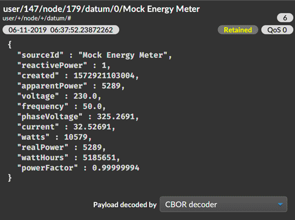

# MQTT.fx CBOR payload decoder

This project contains an addon for the [MQTT.fx][mqttfx] application that can decode CBOR MQTT
message payloads so they are displayed as formatted JSON.




# Install

You can download a precompiled JAR from the [releases][releases] page. The
**mqtt-cbor-decoder-X-all.jar** file should be placed in the MQTT.fx **addon** directory, which
varies by platform:

| OS          | Add-on location                                          |
|:------------|:---------------------------------------------------------|
| **macOS**   | `[USER_HOME]/Library/Application Support/MQTT-FX/addons` |
| **Windows** | `[USER_HOME]\AppData\Local\MQTT-FX\addons`               |
| **Linux**   | `[USER_HOME]/MQTT-FX/addons`                             |


# Building

The build uses Gradle. Build with the `shadowJar` task:

```
./gradlew shadowJar
```

That will produce a `build/libs/mqttfx-cbor-decoder-X-all.jar` which you can install.

[mqttfx]: http://mqttfx.org/
[releases]: https://github.com/SolarNetwork/mqttfx-cbor-decoder/releases
